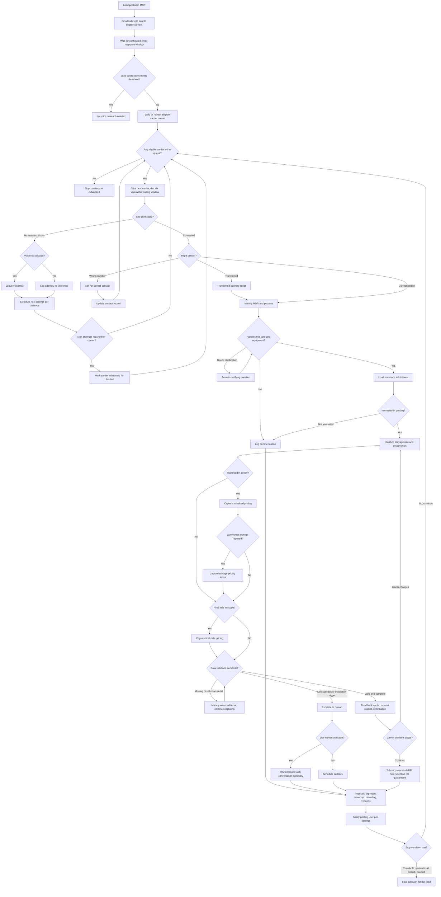

# Carrier Representative Agent — Full Call Flow

End-to-end flow combining activation logic (Section 2), the call script (Sections 5–11, 18), and developer decision logic (Section 12) from MDR's playbook. Cross-reference: [project-info.md](project-info.md), [build-plan.md](build-plan.md).

## Stage-by-stage notes

| Stage | Playbook section | What happens |
|---|---|---|
| Load posted → email sent → wait window | Section 2, Activation Logic | Existing MDR email flow; no voice agent involvement yet |
| Threshold check | Section 2 + Section 12 "Threshold counting" | Only valid, non-duplicate quotes covering the required scope count |
| Queue build | Section 12 "Pre-call eligibility" + "Carrier ranking" | Excludes already-quoted/DNC/ineligible carriers; ranks by lane/equipment match, service history, capacity — never by cheapest historical rate alone |
| Dial / no-answer handling | Section 11, Voicemail and Callback Scripts | Voicemail script used only if allowed and no sensitive shipment details included |
| Attempt cadence | Section 12 "Attempt cadence" | Suggested default: initial call + 1 retry + 1 final attempt before bid close, no repeated same-day calls |
| Wrong number / transfer | Section 5.1, Opening – Correct Contact | Agent asks for the right contact or continues with the transferred-opening script |
| Lane/equipment qualification | Section 5.2, Permission and Qualification | Declines here go straight to logging a decline reason (Section 14 taxonomy) |
| Load presentation & interest check | Section 5.3, Concise Load Presentation | Agent asks for interest before reading every detail |
| Pricing capture | Section 6 (drayage), Section 7/7.1 (transload/storage), Section 8 (final mile) | Full accessorial capture per the pricing field table |
| Validation | Section 12 "Quote validation" + Section 17 "Fail-safe behavior" | Missing/unknown details → marked conditional, call continues. Contradictions/disputes → real escalation |
| Escalation | Section 12 "Human escalation" + Section 16 | Warm transfer if a human is available, otherwise a scheduled callback |
| Read-back & submission | Section 9, Quote Read-Back and Submission | Explicit verbal confirmation required before any quote is submitted; carrier is told selection isn't guaranteed |
| Post-call logging | Section 13, Structured Data to Save in MDR | Full audit trail: transcript, recording, agent/prompt version, disclosure delivered |
| Stop-condition re-check | Section 12 "Stop conditions" | Runs after every single call, not just at the end of a batch — this is what prevents over-calling a load once it's covered |

## Not shown on the diagram (global override)

A **do-not-call request** can happen at any point in any call (Section 10's objection table: "Remove us from calls"). When it does, the agent immediately records the opt-out, ends the call, and the carrier is excluded from all future outreach for this and other loads — this short-circuits the flow from wherever it currently is, rather than following any of the branches above.
